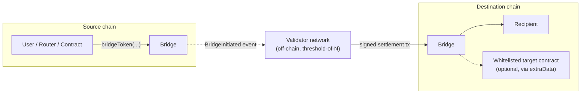
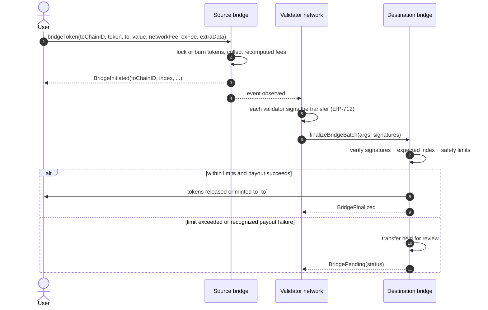

# Cross Bridge Contracts

Smart contracts for the **Cross Bridge** — a multi-signature cross-chain bridge that moves tokens
between the Cross chain and external EVM chains such as BSC.

한국어 문서: [README_KO.md](README_KO.md)

---

## Contents

- [1. Overview](#1-overview)
- [2. How a transfer works](#2-how-a-transfer-works)
- [3. Token model](#3-token-model)
- [4. User-facing API](#4-user-facing-api)
  - [4.1 `bridgeToken` — start a transfer](#41-bridgetoken--start-a-transfer)
  - [4.2 Quoting fees before you send](#42-quoting-fees-before-you-send)
  - [4.3 `extraData` — bridge and call in one step](#43-extradata--bridge-and-call-in-one-step)
  - [4.4 `finalizeBridgeBatch` — settlement on the destination chain](#44-finalizebridgebatch--settlement-on-the-destination-chain)
  - [4.5 Held (pending) transfers and `releasePending`](#45-held-pending-transfers-and-releasepending)
  - [4.6 Read-only functions for tracking](#46-read-only-functions-for-tracking)
  - [4.7 Chain-specific and auxiliary entry points](#47-chain-specific-and-auxiliary-entry-points)
- [5. Validator network](#5-validator-network)
- [6. Security and trust model](#6-security-and-trust-model)
- [7. Contracts](#7-contracts)
- [8. Roles](#8-roles)
- [9. Events](#9-events)
- [10. Build and test](#10-build-and-test)
- [11. Go bindings](#11-go-bindings)
- [12. License](#12-license)

---

## 1. Overview

The bridge does not relay messages between chains. Instead:

1. A user deposits (or burns) tokens on the **source chain**, which emits a `BridgeInitiated` event.
2. An off-chain **validator network** observes that event and each validator produces an EIP-712 signature
   over the transfer details.
3. Once enough signatures exist, a settlement transaction is submitted on the **destination chain**, where
   the bridge contract verifies the signatures and pays out to the recipient.

Every transfer is assigned a **monotonically increasing index** per chain pair, and the destination chain
accepts only the next expected index. A settlement therefore cannot be replayed, skipped, or accepted out of
order. A transfer that is accepted but held for review still advances the index, so its payout may complete
after later transfers.

The authorization model for settlement is a **`threshold`-of-`N` multi-signature**: the contract verifies
that enough distinct addresses currently holding the validator role signed the exact transfer being settled.
Governance (role membership, threshold, upgrades, limits) is separately administered — see
[§6](#6-security-and-trust-model).

---

## 2. How a transfer works





---

## 3. Token model

Each bridgeable token is registered as a **pair** of a local token and its counterpart on a remote chain.
One side of the pair is the **origin** (where the real token lives); the other side holds a **wrapped**
token issued by the bridge.

| Direction | Source chain | Destination chain |
|---|---|---|
| origin → wrapped | tokens are **locked** in the bridge | wrapped tokens are **minted** to the recipient |
| wrapped → origin | wrapped tokens are **burned** | locked original tokens are **released** |

Consequences for users:

- Bridge settlement mints wrapped tokens only after threshold signature verification. Each bridge keeps its own
  local accounting of locked and minted amounts, and an outgoing wrapped transfer cannot exceed the amount
  available in that bridge's local minted accounting for the pair.
- Minting authority on the wrapped token is a **separate trust boundary**. Two implementations exist, so
  identify which one a pair actually uses: `CrossMintableERC20V2` grants `MINTER_ROLE` to the bridge when the
  token is created, but the token's own default administrator can grant that role to further addresses, and
  additional minters make the token's real supply diverge from the bridge's accounting. V2 exposes no
  member-enumeration function, so if you rely on the 1:1 relationship, reconstruct membership from the token's
  `RoleGranted` / `RoleRevoked` history since deployment and confirm individual addresses with `hasRole`. The
  earlier `CrossMintableERC20` instead hard-codes an immutable bridge address as its only minter and burner.
- **Token compatibility is an assumption, not an enforcement.** The bridge records the nominal `value` it
  requested, without measuring the balance actually received. A registered origin token is therefore expected
  to transfer exactly the requested amount and to keep balances stable on its own. Fee-on-transfer and rebasing
  behaviour makes bridge accounting diverge from real custody directly; callback-bearing or otherwise
  non-standard tokens require an explicit compatibility and reentrancy review. None of these should be assumed
  supported.
- Native coins (e.g. CROSS, BNB, ETH) are represented by the reserved address `0x00...01`
  (`Const.NATIVE_TOKEN`) when used as a token argument.
- Wrapped tokens are standard `ERC20` + `ERC20Permit` contracts deployed by the bridge, named
  `Cross Bridge <SYMBOL>` with symbol `<SYMBOL>x`, using the symbol and decimals supplied at registration
  time. Always read `decimals()` from the token rather than assuming it matches the origin token.
- On a **HyperEVM** deployment, wrapped tokens are `HyperMintableERC20` instead of `CrossMintableERC20V2`:
  same shape, plus a HyperCore link surface — a fixed storage slot (`keccak256("HyperCore deployer")`) that
  HyperCore's `finalizeEvmContract{customStorageSlot}` action reads to attach the token to a HyperCore spot
  asset, and a derived HyperCore system address the token can be provisioned at. Provisioning that system
  address requires minting to it directly, an operator action outside the bridge's normal deposit-driven mint
  path, so its balance is **not** reflected in the bridge's own `minted` accounting for the pair — a deliberate
  accounting divergence, not a bug (see `LINKER_ROLE` in §8 and `script/HyperMintableERC20Code.s.sol` for the
  operational procedure and its link runbook).
  - **Link hardening.** `setCoreTokenIndex` no longer accepts an arbitrary index: it calls HyperEVM's Core
    read precompile (`tokenInfo(uint32)` at `0x…080C`) and only records the index if the precompile reports
    `evmContract == address(this)` (a forgery-proof, on-chain proof that Core actually linked this exact
    contract — not merely a plausible-looking one, such as a spot-pair index that resolves to a different
    token) and `decimals() == weiDecimals + evmExtraWeiDecimals`. It also succeeds **at most once** per
    token, and `setHyperCoreDeployer` locks permanently the instant it does. These checks are hard
    operational-error guards, not a defense against a compromised upgrade key — see the AR-1 note below.
  - **Rounded Core transfers.** `transferToCore(amount)` now rounds `amount` down to a whole Core wei
    (`coreUnit()`, derived from the link's `evmExtraWeiDecimals`) before moving it, so it never burns dust;
    the rounding remainder stays with the caller, and it returns the actually-sent amount. It is a
    convenience wrapper, not a standard — Core credits based on the `Transfer.from` of a plain ERC20
    `transfer` to the system address, so any standard-compliant transfer works identically, and no guard on
    this function can be treated as unbypassable.
  - **One-action HyperCore delivery.** A single `transferToCore` credits only its own caller on Core, which
    is a problem when that caller is the `BridgeExecutor` acting on a composed `extraData` call — the
    executor is a contract and cannot sign further Core actions, so a token credited to its Core account
    would be stuck. `transferToCoreFor(address coreRecipient, uint amount)` fixes this: it moves the
    (rounded) amount through the caller to `coreRecipient` and on to the Core system address in the same
    transaction, so the second `Transfer`'s `from` is `coreRecipient` and Core credits *them*, not the
    caller — `coreRecipient`'s EVM balance nets to exactly zero, so the function needs no role gate. Compose
    it as an `extraData` call (`target` = the token, `selector` = `transferToCoreFor`, args =
    `(finalRecipient, amount)`) to move a token BSC → CROSS → HyperEVM → HyperCore in the single user action
    that starts the transfer.
  - **Upgradeable token + factory.** Both the token and its factory (`HyperMintableERC20Code`) are proxies:
    every token created by one factory is a `BeaconProxy` sharing one `UpgradeableBeacon` (one upgrade fixes
    every token at once — the concentration this creates should sit behind a multisig/timelock beacon
    owner), and the factory itself is a UUPS (`ERC1967Proxy`) singleton gated by its own `ADMIN_ROLE`. This
    exists because a HyperCore link is permanent for the EVM address Core finalized against — without
    upgradeability, fixing a bug in an already-linked token means minting an entirely new HyperCore token.
    The CREATE2 initcode a factory predicts against embeds only the beacon's (fixed) address, never the
    logic implementation it currently resolves to, so `computeTokenAddress` / `computeTokenAddressWithName`
    predictions are stable across a beacon upgrade.
  - **AR-1 — the one-shot locks are not upgrade-proof.** Because the token and factory are upgradeable, an
    account holding beacon-owner or factory-`ADMIN_ROLE` upgrade authority can ship a new implementation
    that removes the `setCoreTokenIndex` / `setHyperCoreDeployer` locks described above. Treat the locks as
    guards against **operational mistakes** (a typo'd index, a stale finalizer left writable), not as
    protection against a compromised upgrade key — that protection comes only from keeping the beacon owner
    and the factory's upgrade-approving `ADMIN_ROLE` on a multisig or timelock, never an EOA.
- A transfer is only possible for a **registered** pair. Use `allChainIDs()` / `allTokenPairs()` /
  `getTokenPair()` to discover what is supported on a given deployment.

---

## 4. User-facing API

### 4.1 `bridgeToken` — start a transfer

This is the single entry point for regular users. It is called **on the source chain**.

```solidity
function bridgeToken(
    uint toChainID,
    IERC20 fromToken,
    address to,
    uint value,
    uint networkFee,
    uint exFee,
    bytes calldata extraData
) external payable returns (bool);
```

| Argument | Description |
|---|---|
| `toChainID` | Destination chain ID. Must be a chain for which `fromToken` has a registered pair. |
| `fromToken` | Token to send **on the source chain**. Use `0x00...01` for the native coin. |
| `to` | Recipient address on the destination chain. Cannot be the zero address. |
| `value` | Amount to bridge, **excluding** fees. This is the amount credited on the destination chain. |
| `networkFee` | Upper bound you accept for the destination-chain settlement fee. Must be ≥ the fee recomputed during execution. |
| `exFee` | Upper bound you accept for the bridge service fee. Must be ≥ the fee recomputed during execution. |
| `extraData` | Empty for a plain transfer, or an encoded call to execute on arrival (see [4.3](#43-extradata--bridge-and-call-in-one-step)). |

**Preconditions**

- The bridge is not paused, the destination chain is not paused, and the token is not paused for outgoing transfers.
- The `(toChainID, fromToken)` pair is registered.
- `value` is non-zero and at least the minimum transfer amount (a USD-denominated floor converted to token units).
- `networkFee` and `exFee` are each at least the corresponding fee recomputed at execution time.
- `extraData` is within `maxExtraDataLength()` bytes (a value of `0` means unlimited).
- When bridging a wrapped token, `value` cannot exceed the amount recorded in the bridge's local minted
  accounting for that pair (readable from `getTokenPair`).

**Fees are recomputed on-chain — this matters for how you pay**

The `networkFee` and `exFee` arguments act as **upper-bound assertions**, not as the amounts charged. During
execution the contract recomputes both fees from current prices and gas configuration, requires each argument
to be at least the recomputed value, and then **charges and records the recomputed amounts**.

| Token type | What to send |
|---|---|
| Native coin | `msg.value` must equal `value` **plus the fees recomputed at execution time** — an exact match. Padding `msg.value` with a safety margin reverts. |
| ERC20 | `msg.value == 0`. The allowance consumed at execution is `value` + the **recomputed** fees. Approving your upper bounds (`value + networkFee + exFee`) tolerates a fee increase, but any unused approval remains. |

Integration guidance:

- Quote immediately before submitting ([4.2](#42-quoting-fees-before-you-send)).
- For **native** transfers, if the fees recomputed at execution time differ from what you funded in `msg.value`,
  the transaction reverts. That is a safe failure — no funds move — but expect to retry with a fresh quote. Do
  not add a margin to `msg.value`.
- For **ERC20** transfers, choose the fee upper bounds deliberately: they set the maximum you accept, and if you
  approve exactly `value + networkFee + exFee` they also become the basis of the allowance you grant. Because
  only the recomputed amount is pulled, a padded approval leaves residual allowance to the bridge — reset or
  revoke it after a successful transfer if you do not intend a standing approval.

**Result** — the call emits `BridgeInitiated` containing the assigned `index`, the paired destination token,
the recipient, the amount, and the **recomputed** fees. That `index` is the identifier used to track
settlement on the destination chain. Fees are transferred out immediately and are not refundable once the
transfer starts.

### 4.2 Quoting fees before you send

Quotes are read from `BridgeVerifier`, whose address is available as `bridge.bridgeVerifier()`.

```solidity
// Minimum transfer amount and the two fee components for a given amount
function calculateFee(uint remoteChainID, IERC20 token, uint value)
    external view returns (uint minimumValue, uint networkFee, uint exFee);

// Same, but returns the effective exchange-fee rate instead of the computed fee
function getTokenConfig(uint remoteChainID, IERC20 token)
    external view returns (uint minimumValue, uint networkFee, uint exFeeRate);
```

| Component | Meaning |
|---|---|
| `minimumValue` | The verifier's computed minimum for this token, derived from a USD floor. If the token has no published price the configured default price is used; if that effective price is zero the minimum falls back to one whole token. It can also be `0` for high-priced tokens — independently of this, `bridgeToken` always rejects a `value` of `0`. |
| `networkFee` | Estimated cost of the destination-chain settlement, expressed in the bridged token. |
| `exFee` | Proportional service fee: `value × exFeeRate / denominator()`, where `denominator()` is `10000`. |
| `exFeeRate` | The **effective** rate actually applied — already resolved from the token-specific rate, the default rate, or a configured exemption. |

`networkFee` tracks destination gas configuration and token prices, so quotes change over time. The same
values are recomputed inside `bridgeToken`, which is why the payment rules in [4.1](#41-bridgetoken--start-a-transfer)
are strict for native transfers.

### 4.3 `extraData` — bridge and call in one step

`extraData` lets a transfer trigger a call on the destination chain in the same settlement transaction —
for example bridging tokens and staking them for the recipient.

```
extraData = target (20 bytes) || selector (4 bytes) || abi-encoded arguments
```

- `target` must be **whitelisted** on the destination chain's `BridgeExecutor`. A target may additionally be
  restricted to specific function selectors; check `isMethodCheckEnabled(target)` to know whether selector
  filtering applies, then `isWhitelistedMethod(target, selector)`.
- The bridged amount is made available to the target; whatever the target does not consume is sent to `to`.
- `extraData` is part of the signed payload, so it cannot be altered between the two chains.

Fallback behaviour:

| Situation | Result |
|---|---|
| `extraData` shorter than 24 bytes, no executor configured, target not whitelisted, or the pre-call ERC20 approval to the executor fails | Plain payout to `to`. No `ExtraCallExecuted` event is emitted. |
| Whitelisted target, call succeeds | Target consumes what it needs, remainder goes to `to`. `ExtraCallExecuted` emitted with `success = true`. |
| Whitelisted target, call fails | Plain payout to `to` is attempted instead. `ExtraCallExecuted` emitted with `success = false`. |
| Plain payout reports a recognized transfer or mint failure | The transfer is held for review ([4.5](#45-held-pending-transfers-and-releasepending)). Unexpected failures revert instead, as described in [4.4](#44-finalizebridgebatch--settlement-on-the-destination-chain). |

A failed composed call therefore does not lose funds: the transfer degrades to a plain payout, or to a held
transfer that can be retried. Whitelisting is performed by the `BridgeExecutor` administrators — contact them
to have an integration target registered.

### 4.4 `finalizeBridgeBatch` — settlement on the destination chain

```solidity
function finalizeBridgeBatch(
    FinalizeArguments[] calldata args,
    uint8[][] memory v,
    bytes32[][] memory r,
    bytes32[][] memory s
) external payable returns (bool);
```

Users normally never call this — the validator network submits it automatically. It is documented because it
is **permissionless**: anyone holding a valid set of validator signatures can submit a settlement.

Requirements for a submission to be accepted:

- The bridge is not paused, the source-chain entry is not paused, and each `toToken` is registered for its
  `fromChainID`.
- For each entry, `index` must be exactly the next expected index for that source chain
  (`getNextFinalizeIndex(fromChainID)`).
- `v`, `r`, `s` must each have the same length as `args`, and within an entry the three signature arrays must
  have equal length.
- Each entry must allow at least `threshold()` authorized signers to be counted in **strictly ascending
  signer-address order**. Recovered addresses that are duplicated, do not hold the validator role, or are not
  ascending are simply not counted — so always submit signatures sorted by signer address. A malformed
  signature makes the call revert.
- `msg.value` must be zero.

Signatures are EIP-712 over:

```
FinalizeBridge(uint256 fromChainID,uint256 index,address toToken,address to,uint256 value,bytes extraData)
```

with domain name `Validator`, version `1.0.0`, the destination chain ID, and the destination bridge address as
`verifyingContract` (readable as `domainSeparator()`). A signature therefore cannot be reused against a
different destination chain ID or verifying contract.

If any entry fails these requirements the **whole batch reverts**.

An entry that passes verification but hits a value limit, or whose payout fails in a **recognized** way — the
recipient call, ERC20 transfer, or mint reports failure — is accepted and **held for review**. That is a normal
outcome, not a batch failure. **Unexpected** conditions are different: for example an insufficient native
balance in the bridge or an accounting inconsistency reverts the whole batch instead of producing a held
transfer, leaving the expected index unchanged.

### 4.5 Held (pending) transfers and `releasePending`

A settlement that passes signature verification but cannot be paid out for a recognized reason is **held**
rather than lost. Common reasons are safety limits (an unusually large single transfer, or unusually high volume within a
time window), a paused token, or a recipient that rejects the transfer.

`BridgePending` is emitted with a status describing the reason:

| Status | Meaning |
|---|---|
| `TokenPaused` | Incoming transfers for that token are paused. |
| `VerificationAmountThresholdExceeded` | Single-transfer value limit exceeded. |
| `PeriodTotalValueThresholdExceeded` | Rolling time-window volume limit exceeded. |
| `TransferFailed` / `MintFailed` | Payout to the recipient failed. |
| `CrossSupplyLimitExceeded` | Cross chain native supply cap would be exceeded. |
| `TokenScoreOverflow` / `TokenCurrentVolumeOverflow` | Value could not be evaluated safely. |

```solidity
function releasePending(uint remoteChainID, uint index) external;
```

`releasePending` is callable by **anyone** and retries the payout. It succeeds when:

- the bridge is not paused, the source-chain entry is not paused, and incoming transfers for the token are not
  paused;
- the review delay stored on the held record has expired (`delayExpiration`, `0` meaning no delay);
- the payout itself succeeds.

The single-transfer and time-window value limits are **not** re-evaluated on retry — they were already
evaluated when the transfer was first accepted. On the Cross chain, the native supply cap **is** re-checked.

Composed `extraData` calls are never re-executed on a retry; a held transfer always pays out plainly.

**Privileged resolution.** `VERIFIER_ROLE` can force-release a held transfer, bypassing pause, delay and limit
checks, and can redirect the payout to a different recipient — this is the recovery path when the original
recipient permanently rejects funds. `ADMIN_ROLE` can remove a held record without paying out. These are
trusted-governance powers; see [§6](#6-security-and-trust-model).

Inspect a held transfer with `getPendingArguments(remoteChainID, index)` and list all held indices with
`allPendingIndex(remoteChainID)`. The review delay is initialized to 24 hours but is administrator-configurable,
so read `delayExpiration` from the record rather than assuming a fixed value.

### 4.6 Read-only functions for tracking

On the bridge contract:

| Function | Returns |
|---|---|
| `allChainIDs()` | Every remote chain ID registered on this bridge |
| `allTokenPairs(remoteChainID)` | All token pairs for a remote chain, including local supply accounting |
| `getTokenPair(remoteChainID, token)` | Pair details: counterpart token, origin flag, paused flag, locked/minted amounts |
| `getNextInitiateIndex(remoteChainID)` | Index that the next outgoing transfer will receive |
| `getNextFinalizeIndex(remoteChainID)` | Index that will be accepted next for that source chain |
| `allPendingIndex(remoteChainID)` / `getPendingArguments(remoteChainID, index)` | Held transfers and their stored arguments, status, and `delayExpiration` |
| `isTokenFinalizePaused(remoteChainID, token)` | Whether incoming transfers of a token are paused |
| `maxExtraDataLength()` | Maximum `extraData` size (`0` = unlimited) |
| `threshold()` / `domainSeparator()` | Multi-signature threshold and EIP-712 domain separator of this bridge |
| `paused()` | Global pause state |

On `BridgeVerifier`:

| Function | Returns |
|---|---|
| `calculateFee(chainID, token, value)` | `(minimumValue, networkFee, exFee)` |
| `getTokenConfig(chainID, token)` | `(minimumValue, networkFee, effective exFeeRate)` |
| `getTokenPrice(token)` | `(exist, price)`. When `exist == false` the returned price is the configured fallback price, not a live quote. |
| `getMinimumTokenValue()` | USD floor, expressed with the price feed's dollar precision |
| `denominator()` | `10000`, the denominator for fee rates |

To follow a transfer end to end: take `index` from `BridgeInitiated` on the source chain, then watch for
`BridgeFinalized` or `BridgePending` with the same `(fromChainID, index)` on the destination chain.

When you build that tracking, keep two identities apart:

- **Raw log identity**, for discarding logs you already processed: (chain ID, transaction hash, log index).
- **Logical transfer identity**, for correlating the two chains: (chain ID, bridge address, **direction**,
  remote chain ID, `index`). The remote chain ID is `toChainID` in `BridgeInitiated` and `fromChainID` in
  `BridgeFinalized` / `BridgePending`. Direction matters because outgoing and incoming indices are counted
  independently, so the same `(remote chain ID, index)` can exist in both directions on one bridge.

Also treat logs as revertible and states as non-final: wait for whatever finality your integration requires
before showing a transfer as complete, handle logs removed by a chain reorganization, and remember that
`BridgePending` is **not** terminal — the same transfer can later emit `BridgeFinalized` when it is released, or
`PendingRemoved` if it is dropped without payout.

### 4.7 Chain-specific and auxiliary entry points

**Cross chain — native supply cap.** The amount of native CROSS that may be paid out by the bridge is bounded
by a configurable cap, readable via `crossSupply()` and `crossSupplyLimit()`. A settlement that would exceed
it is held with `CrossSupplyLimitExceeded`. The cap applies to automatic settlement and to public retries; a
privileged manual release bypasses it.

**BSC — coordinated burn.**

```solidity
function burnCrossToDeadWallet(address deadWallet, uint amount, bool alreadyTransferred) external returns (bool);
```

With `alreadyTransferred = false` any holder may burn CROSS and have the burn reflected on the Cross chain.
Conditions: the bridge is not paused, `amount` is non-zero, `deadWallet` is one of the pre-approved burn
addresses, and the caller has approved the bridge to spend `amount` of the configured CROSS token.

With `alreadyTransferred = true` no token transfer happens on BSC — the caller asserts that the tokens were
already sent to the burn address, and the initiation event is emitted with the bridge itself as the source.
That variant is restricted to `ADMIN_ROLE`.

**`permitBridgeTokenBatch` — relayer entry point.**

```solidity
function permitBridgeTokenBatch(BridgeTokenArguments[] calldata args, PermitArguments[] calldata permitArgs) external payable;
```

Starts transfers from EIP-2612 permit signatures instead of prior approvals. It is restricted to holders of
`INITIATOR_ROLE` so that transfer parameters cannot be injected by a third party using a captured permit.

| Struct | Fields |
|---|---|
| `BridgeTokenArguments` | `toChainID`, `fromToken`, `from`, `to`, `value`, `networkFee`, `exFee`, `extraData` — same meaning as the `bridgeToken` arguments. **`from` is ignored here**: the funds always come from `permitArgs.account`. |
| `PermitArguments` | `token`, `account`, `value`, `deadline`, `v`, `r`, `s` — a standard EIP-2612 permit granting the **bridge** an allowance. |

Conditions: `args.length == permitArgs.length`; for each entry `permitArgs.token` equals `fromToken`, `to`
equals `permitArgs.account`, the permit is valid and unexpired, and `permitArgs.value` covers `value` plus the
fees recomputed at execution time; each pair must be registered and active. `permitArgs.value` becomes the
bridge's allowance, so any part not consumed remains approved.

The shared pause, registration, minimum-amount, fee, wrapped-supply and `extraData` conditions from
[4.1](#41-bridgetoken--start-a-transfer) apply to every entry. This entry point works only with ERC20 tokens
that implement EIP-2612 permit compatibly — the native-coin sentinel cannot be used here. The batch is
**atomic**: one failing entry reverts every entry. Never send value with this call: a non-empty batch requires
`msg.value == 0`, and value sent alongside an empty batch simply stays in the bridge.

**`SwapBridgeRouter` — swap and bridge in one transaction.**

An optional helper that swaps on a Uniswap V3 market and immediately starts a bridge transfer with the output.
Eight entry points combine three choices: exact-input vs exact-output, single-pool vs multi-hop path, and ERC20
vs native input. Every entry point takes a params struct plus a `deadline`.

| Entry point | Path form | Input | Required `msg.value` |
|---|---|---|---|
| `swapBridgeExactInputSingle` | single pool | ERC20 | `0` |
| `swapBridgeExactInput` | multi-hop `path` | ERC20 | `0` |
| `swapBridgeExactOutputSingle` | single pool | ERC20 | `0` |
| `swapBridgeExactOutput` | multi-hop `path` | ERC20 | `0` |
| `swapBridgeExactInputSingleETH`, `swapBridgeExactInputETH` | as above | native coin | exactly `amountIn` |
| `swapBridgeExactOutputSingleETH`, `swapBridgeExactOutputETH` | as above | native coin | at least `amountInMaximum` |

Parameters:

| Field | Used by | Meaning |
|---|---|---|
| `tokenIn`, `tokenOut` | single-pool variants | Input and output token. In the ETH variants `tokenIn` must be the wrapped native token. |
| `fee` | single-pool variants | Uniswap V3 fee tier identifying the pool. |
| `path` | multi-hop variants | Encoded swap path: input → output for exact-input, and **reversed** (output → input) for exact-output. |
| `amountIn` | exact-input | Input amount supplied. A `sqrtPriceLimitX96` stop can end the swap early, and the unspent remainder is refunded — so this is the amount supplied, not necessarily the amount spent. |
| `amountOutMinimum` | exact-input | Slippage floor on the swap output, before bridge fees are deducted. |
| `amountOut` | exact-output | Exact amount to be credited **on the destination chain**, after bridge fees. |
| `amountInMaximum` | exact-output | Maximum input you accept; the unused part is refunded. |
| `sqrtPriceLimitX96` | single-pool variants | Uniswap V3 price limit for the swap; `0` for no limit. |
| `bridgeParams.toChainID` | all | Destination chain ID. |
| `bridgeParams.recipient` | all | Recipient on the destination chain. |
| `bridgeParams.extraData` | all | Forwarded to the bridge; same rules as [4.3](#43-extradata--bridge-and-call-in-one-step). |
| `deadline` | all | The call reverts once this timestamp has passed. |

Common rules:

- ERC20 variants: approve the router for `amountIn` (exact-input) or `amountInMaximum` (exact-output) and send
  no value.
- Unspent input is refunded to the caller — the unused part of `amountInMaximum` on exact-output, and any
  unspent remainder on exact-input — as the input token, or as native coin in the ETH variants. In the
  exact-output ETH variants any `msg.value` above `amountInMaximum` is refunded as well.
- Bridge fees are deducted from the swap output; the amount credited on the destination chain is `bridgeValue`
  in the `SwapBridge` event, which also carries `initiateIndex` — the bridge transfer index to track as in
  [4.6](#46-read-only-functions-for-tracking).
- The struct declarations are in `src/interface/ISwapBridgeRouter.sol`.

Quote helpers:

| Helper | Input | Returns |
|---|---|---|
| `getAmountSwapBridgeOut(toChainID, tokenIn, tokenOut, fee, amountIn)` | input amount, single pool | `status`, `swapAmountOut`, `bridgeValue`, `networkFee`, `exFee` |
| `getAmountSwapBridgeOutMultihop(toChainID, path, amountIn)` | input amount, multi-hop | same as above |
| `getAmountSwapBridgeIn(toChainID, tokenIn, tokenOut, fee, bridgeValue)` | desired destination amount, single pool | `status`, `amountIn`, `swapAmountOut`, `networkFee`, `exFee` |
| `getAmountSwapBridgeInMultihop(toChainID, path, bridgeValue)` | desired destination amount, multi-hop | same as above |
| `getExpectedBridgeAmount(toChainID, token, totalAmount)` | amount before fees | `status`, `bridgeValue`, `networkFee`, `exFee` |
| `calculateBridgeFees(toChainID, token, value)` | destination amount | `minimumValue`, `networkFee`, `exFee` |

The four `getAmountSwapBridge*` helpers are **not** `view` — they simulate the swap through the Uniswap quoter,
so call them off-chain. `getExpectedBridgeAmount` and `calculateBridgeFees` are `view`.

`status` is a `QuoteStatus`: `Success` (1) means usable; `NoPair` (2) the token pair is not registered for that
chain; `InsufficientForFee` (3) the amount cannot cover the network fee; `InsufficientValue` (4) the resulting
bridge value is below the minimum; `InvalidSwap` (5) the swap could not be quoted (no pool or insufficient
liquidity); `Invalid` (0) is the uninitialized default. Only act on `Success`.

---

## 5. Validator network

The off-chain counterpart of these contracts is an independent validator network
([`bridge-validator`](https://github.com/to-nexus/bridge-validator)). Its responsibilities:

| Responsibility | Description |
|---|---|
| **Observation** | Each validator independently watches the bridge contract on every registered chain, and acts on an event only after its configured confirmation/finality policy for that chain is satisfied. |
| **Attestation** | For each observed transfer, a validator signs an EIP-712 message bound to the destination bridge's domain. A signature attests to exactly one transfer: chain pair, index, token, recipient, amount, and `extraData`. |
| **Coordination** | Validators do not call each other. They publish signatures to a shared, replicated coordination cluster (etcd), which also elects a single leader among the nodes. |
| **Submission** | The elected leader submits settlement transactions in strict transfer-index order, once a transfer has reached the signature threshold. Concentrating submission in one node avoids duplicate and competing settlement transactions. |

Properties that follow, and their limits:

- **Settlement needs a quorum.** A signature counts only if the recovered signer currently holds the
  validator role on-chain, and settlement requires `threshold` distinct signers. No validator can authorize a
  payout alone unless the configured threshold is `1` — read `threshold()` to see the value in force.
- **Validators do not hold user funds.** They only produce signatures; custody stays in the bridge contracts.
- **Availability, not custody, is what degrades.** If fewer than `threshold` validators are available,
  settlement stops until participation recovers. Deposits remain accounted for on-chain and settlement
  resumes from the next expected index.
- **Revocation takes effect on-chain.** Removing the validator role from an address invalidates its
  signatures for future settlements.
- **Governance is trusted.** The validator set, the threshold, contract upgrades and limits are controlled by
  administrative roles rather than by the validator quorum — see [§6](#6-security-and-trust-model) and
  [§8](#8-roles).

Operational details of the network — deployment topology, coordination-store layout, timing and retry
policies, and key management — are outside the scope of this document.

---

## 6. Security and trust model

| Mechanism | Effect |
|---|---|
| Threshold multi-signature | Settlement requires `threshold` distinct authorized validator signatures over the exact transfer. |
| EIP-712 domain binding | Signatures are bound to the destination chain ID and bridge address, so they cannot be reused against a different destination chain ID or verifying contract. |
| Sequential indices | Each source-chain transfer can be accepted at most once and only in index order. A held transfer advances the index, so its payout may complete after later transfers. |
| Local supply accounting | Each bridge tracks locked (origin) and minted (wrapped) amounts, and outgoing wrapped transfers cannot exceed the bridge's local minted accounting. The 1:1 cross-chain relationship holds as long as attestations are valid and wrapped `MINTER_ROLE` membership stays limited to the bridge. |
| Value limits | Single-transfer and rolling-window value limits divert unusually large flows to a held state instead of paying out automatically. |
| Native supply cap | On the Cross chain, automatic payouts and public retries of the native coin are bounded by an adjustable cap. |
| Layered pausing | Transfers can be halted globally, per chain, or per token — independently for the outgoing and incoming direction. |
| Safe payout | Recognized payout failures (recipient call, ERC20 transfer, or mint reporting failure) and failed composed calls degrade to a plain payout or a held transfer instead of losing funds. Unexpected conditions revert the settlement instead of producing a held transfer. |
| Composed-call whitelisting | `extraData` can only reach targets explicitly whitelisted by the `BridgeExecutor` administrators, optionally restricted to specific function selectors. |
| Reentrancy protection | Transfer initiation, batch settlement, held-transfer payout and composed-call execution are reentrancy-guarded. |

**Trusted powers.** Users should treat the following as part of the risk model:

- `DEFAULT_ADMIN_ROLE` grants and revokes every role, including the validator role, so it ultimately controls
  who can authorize settlements.
- The bridge's `ADMIN_ROLE` can upgrade the bridge implementation (UUPS), change the signature threshold,
  reconfigure the review delay, replace the fee/limit and executor components, and remove a held transfer
  without paying out.
- `BridgeVerifier`'s and `BridgeExecutor`'s own `ADMIN_ROLE` holders — independent membership sets — control the
  value limits and price-feed reference, and the composed-call whitelist, respectively.
- `VERIFIER_ROLE` can force-release a held transfer, bypassing pause, delay and limit checks, and can redirect
  the payout to a different recipient.
- `OPERATOR_ROLE` can pause transfers globally, per chain, or per token.
- `PRICER_ROLE` publishes the prices that drive fees and value limits.
- Each `CrossMintableERC20V2` wrapped token has its **own** default administrator, which controls `MINTER_ROLE`
  on that token independently of the bridge's roles. (The earlier `CrossMintableERC20` has no such
  administrator — its minter is a single immutable bridge address.)

---

## 7. Contracts

| Contract | Purpose |
|---|---|
| `BaseBridge` | Core bridge: transfer initiation, signature-verified settlement, held-transfer handling, registry and roles. Upgradeable (UUPS). |
| `CrossBridge` | Cross-chain deployment of the bridge; adds the native CROSS supply cap. |
| `BSCBridge` / `BSCBridgeV2` | BSC deployment of the bridge; V2 adds coordinated burn support. |
| `BridgeVerifier` | Fee quoting and value-limit evaluation. |
| `BridgeExecutor` | Executes whitelisted `extraData` calls during settlement. |
| `PriceFeed` | Token and native-coin price source used for fees and limits. Upgradeable (UUPS). |
| `CrossMintableERC20V2` | Wrapped token issued by the bridge (`ERC20` + `ERC20Permit`). |
| `HyperMintableERC20` | HyperEVM-specific wrapped token; `CrossMintableERC20V2` plus a hardened HyperCore link slot. Upgradeable (`BeaconProxy`, one shared `UpgradeableBeacon` per factory). |
| `HyperMintableERC20Code` | Factory for `HyperMintableERC20`; deploys via CREATE2 at a deterministic, pre-computable address that survives a beacon logic upgrade. Upgradeable (UUPS). |
| `SwapBridgeRouter` | Optional swap-and-bridge router (Uniswap V3). |
| `BridgeBot` | Optional helper contract for scheduled recurring transfers. |

Supporting modules: `abstract/RoleManager` (access control), `abstract/ValidatorManager`
(EIP-712 domain and threshold verification), `abstract/BridgeRegistry` (chains, token pairs, indices,
held records), and `lib/` (constants, amount conversion).

---

## 8. Roles

Access control is role-based, and roles are **scoped to the contract that exposes the protected function**.
`BaseBridge`, `BridgeVerifier`, `PriceFeed`, `BridgeExecutor` and each wrapped token keep independent
access-control state, so the same role name on two contracts is two different membership sets. Each contract
also has its own administrator; the bridge's administrator does not govern the others.

Enumerating members is not uniformly available: `getRoleMembers(role)` exists on the bridge, `PriceFeed` and
`BridgeVerifier`, while `BridgeExecutor` and `CrossMintableERC20V2` expose only `hasRole` plus
`RoleGranted` / `RoleRevoked` events, so their full membership must be reconstructed from event history.

| Role | Contract | Capability |
|---|---|---|
| `DEFAULT_ADMIN_ROLE` | Bridge | Grants and revokes every bridge role below, including `VALIDATOR_ROLE`. Assigned to the deployment owner at initialization. |
| `ADMIN_ROLE` | Bridge | Contract upgrades, threshold changes, component wiring, review-delay configuration, removing a held record |
| | Verifier | Value-limit and time-window configuration, settlement-gas assumption, price-feed replacement |
| | Executor | Target/selector whitelist, return-data limit, stuck-asset recovery |
| `VALIDATOR_ROLE` | Bridge | Signatures counted toward the settlement threshold |
| `OPERATOR_ROLE` | Bridge | Pausing globally, per chain, or per token |
| `EDITOR_ROLE` | Bridge | Registering token pairs, `extraData` size limit |
| | Verifier | Exchange-fee rates, default price, minimum transfer value |
| `VERIFIER_ROLE` | Bridge | Force-releasing held transfers, redirecting a payout, adjusting a review window |
| `PRICER_ROLE` | PriceFeed | Publishing token and native-coin prices |
| | Verifier | Publishing destination-chain gas prices |
| `INITIATOR_ROLE` | Bridge | Submitting permit-based batched transfers |
| `EXECUTOR_ROLE` | Executor | Executing composed `extraData` calls — held by the bridge |
| `MINTER_ROLE` | Wrapped token | Minting and burning. Granted to the bridge at creation; in `CrossMintableERC20V2` it is administered by that token's own default administrator |
| `LINKER_ROLE` | `HyperMintableERC20` | Role checked by `setHyperCoreDeployer` / `setCoreTokenIndex` — but *holding* it is not the same as being able to call them; see below. `setCoreTokenIndex` succeeds at most once per token, and `setHyperCoreDeployer` locks permanently once it has (see §3 for the AR-1 caveat) |

`HyperMintableERC20` distinguishes **role membership** from **effective authority**. `hasRole(LINKER_ROLE,
account)` reports whether `account` has been granted the role — an ordinary, revocable OZ grant. Whether
`account` can actually call `setHyperCoreDeployer` / `setCoreTokenIndex` right now is
`isLinkAuthority(account)`, and after this round the two are no longer the same question: the token's
*current* `defaultAdmin()` always has authority, whether or not it holds `LINKER_ROLE`, and it tracks
`beginDefaultAdminTransfer` / `acceptDefaultAdminTransfer` automatically — a stale former admin loses
authority the instant transfer completes, with no separate role housekeeping required. The only other
authority is the immutable `factoryLinker()` (the creating `HyperMintableERC20Code`), and only while it still
holds `LINKER_ROLE`: the token's default admin can `revokeRole(LINKER_ROLE, factoryLinker())` to cut the
factory off, and `grantRole` it back later. A `LINKER_ROLE` grant to any other address changes `hasRole` but
confers no `isLinkAuthority` — so slot writes are always limited to exactly these two principals.

`HyperMintableERC20Code`'s `tokenAdmin()` — the default admin every token it creates gets — and `beacon()` —
the `UpgradeableBeacon` every created token's `BeaconProxy` points at — are fixed at `initialize` and have no
setter, but are ordinary storage rather than `immutable`: the factory is itself a UUPS proxy, so its logic
contract's constructor only disables initializers and cannot bake in per-deployment values the way a
non-proxied constructor could. Changing either for *future* tokens still means redeploying the factory; an
*already deployed* token's admin can still move via its own `beginDefaultAdminTransfer` /
`acceptDefaultAdminTransfer`, and its logic can still be fixed in place via a beacon upgrade without
redeploying the factory at all. Likewise, a token's `factoryLinker` is fixed at creation to the factory that
created it — replacing a bridge's `crossMintableERC20Code` does **not** transfer management of previously
created tokens to the new factory; keep the old factory around for those, or have the token's default admin
call it directly. Record each token's creating factory address, and its beacon address, in your operational
ledger.

During the pre-finalize window (see the link runbook in `script/HyperMintableERC20Code.s.sol`), monitor
`HyperCoreDeployerSet`, `CoreTokenIndexSet`, `RoleGranted` / `RoleRevoked` for both `LINKER_ROLE` and
`DEFAULT_ADMIN_ROLE` (the latter is when authority actually moves — the two-step transfer's
`DefaultAdminTransferScheduled` / `DefaultAdminTransferCanceled` events are only the announcement), and
additionally re-query `defaultAdmin()` / `isLinkAuthority()` periodically so a missed event can't hide who
currently controls the link slots.

---

## 9. Events

| Event | Emitted when |
|---|---|
| `BridgeInitiated` | A transfer is started on the source chain (carries the transfer `index` and the charged fees) |
| `BridgeFinalized` | A transfer is paid out on the destination chain |
| `BridgePending` | A transfer is held, with a status describing the reason |
| `ExtraCallExecuted` | A composed `extraData` call was attempted, successfully or not |
| `ManualReleased` / `PendingRemoved` / `VerificationDelayExpirationSet` | A held transfer was force-resolved, removed, or its review window changed |
| `ThresholdChanged` | The multi-signature threshold changed |
| `TokenPairRegistered` / `TokenPauseSet` / `ChainPauseSet` | Registry or availability changed |
| `PriceUpdated` / `NativeTokenPriceUpdated` / `GasPriceUpdated` / `ExchangeFeeUpdated` | Pricing or fee configuration changed |

---

## 10. Build and test

Built with [Foundry](https://book.getfoundry.sh/). Dependencies are git submodules.

```bash
git submodule update --init --recursive
forge build
forge test
forge test --match-contract BridgeExecutorTest -vvv
forge test --gas-report
forge fmt
```

Notes:

- The default profile compiles with the IR pipeline, which is slow but keeps contracts within the size limit.
- An alternative profile is available for the BSC V2 bridge: `FOUNDRY_PROFILE=v2 forge build`.
- Import paths are resolved through `remappings.txt`.

The test suite covers round-trip transfers, registry and permission behaviour, revert and held-transfer edge
cases, composed `extraData` execution and fallback, value-limit monitoring, the native supply cap, signature
and threshold verification, wrapped tokens, the swap router, and gas measurements.

---

## 11. Go bindings

`binding/go` contains generated Go bindings (`abigen`) published as a separate module:

```
module github.com/to-nexus/bridge-contracts/binding/go

import "github.com/to-nexus/bridge-contracts/binding/go/src"   // package binding
```

They are the integration surface used by the validator network and can be imported by any Go client that needs
typed access to the bridge ABI and events — contract constructors, typed event structs such as
`BaseBridgeBridgeInitiated`, and log filterers/parsers. The files are generated output and are regenerated when
the contract ABIs change, so pin a version that matches the deployment you target.

---

## 12. License

MIT
