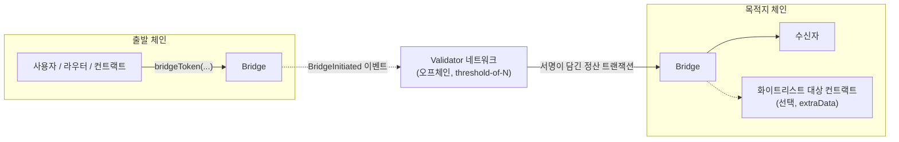
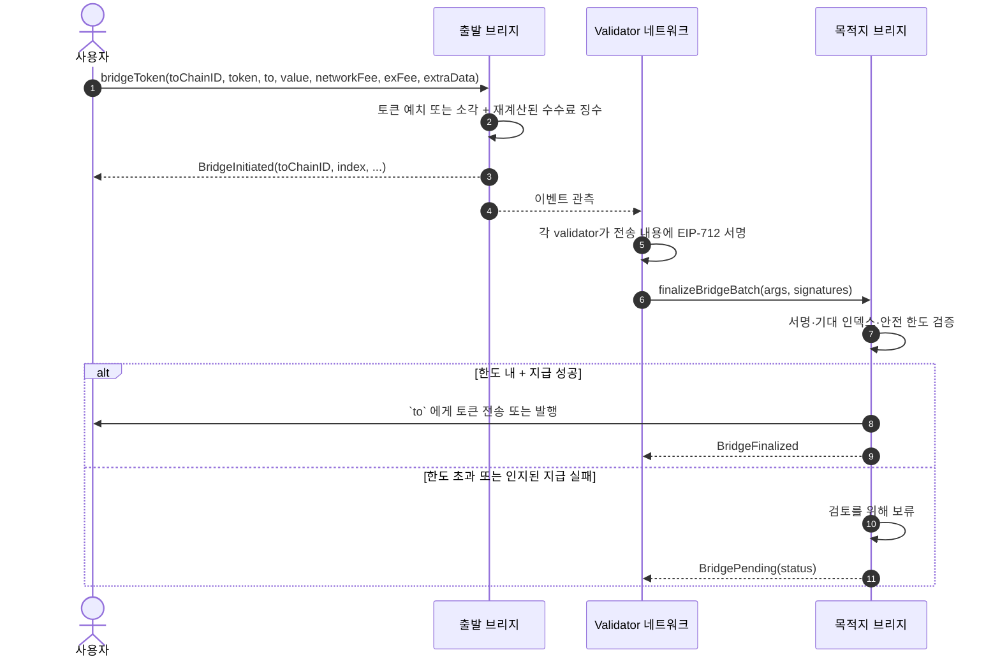

# Cross Bridge Contracts

**Cross Bridge** 스마트 컨트랙트 — Cross 체인과 BSC 등 외부 EVM 체인 사이에서 토큰을 이동시키는
멀티시그 기반 크로스체인 브리지입니다.

English: [README.md](README.md)

---

## 목차

- [1. 개요](#1-개요)
- [2. 전송 흐름](#2-전송-흐름)
- [3. 토큰 모델](#3-토큰-모델)
- [4. 사용자 API](#4-사용자-api)
  - [4.1 `bridgeToken` — 전송 시작](#41-bridgetoken--전송-시작)
  - [4.2 전송 전 수수료 조회](#42-전송-전-수수료-조회)
  - [4.3 `extraData` — 전송과 동시에 호출](#43-extradata--전송과-동시에-호출)
  - [4.4 `finalizeBridgeBatch` — 목적지 체인 정산](#44-finalizebridgebatch--목적지-체인-정산)
  - [4.5 보류된 전송과 `releasePending`](#45-보류된-전송과-releasepending)
  - [4.6 조회용 함수](#46-조회용-함수)
  - [4.7 체인별 및 부가 진입점](#47-체인별-및-부가-진입점)
- [5. Validator 네트워크](#5-validator-네트워크)
- [6. 보안과 신뢰 모델](#6-보안과-신뢰-모델)
- [7. 컨트랙트](#7-컨트랙트)
- [8. 역할](#8-역할)
- [9. 이벤트](#9-이벤트)
- [10. 빌드와 테스트](#10-빌드와-테스트)
- [11. Go 바인딩](#11-go-바인딩)
- [12. 라이선스](#12-라이선스)

---

## 1. 개요

이 브리지는 체인 간에 메시지를 중계하는 방식이 아닙니다.

1. 사용자가 **출발 체인**에서 토큰을 예치(또는 소각)하면 `BridgeInitiated` 이벤트가 발생합니다.
2. 오프체인 **validator 네트워크**가 이 이벤트를 관측하고, 각 validator가 전송 내용에 대해
   EIP-712 서명을 생성합니다.
3. 서명이 충분히 모이면 **목적지 체인**에 정산 트랜잭션이 제출되고, 브리지 컨트랙트가 서명을 검증한 뒤
   수신자에게 지급합니다.

모든 전송에는 체인쌍 단위로 **단조 증가하는 인덱스**가 부여되며, 목적지 체인은 다음에 처리해야 할 인덱스만
받아들입니다. 따라서 정산의 재실행·건너뛰기·순서 변경이 불가능합니다. 단, 접수되었지만 검토를 위해 보류된
전송도 인덱스를 소비하므로, 그 지급은 이후 전송보다 늦게 완료될 수 있습니다.

정산 권한 모델은 **`threshold`-of-`N` 멀티시그**입니다. 컨트랙트는 현재 validator 역할을 보유한 서로 다른
주소가 "정산하려는 그 전송"에 충분히 서명했는지를 검증합니다. 역할 구성, 임계값, 업그레이드, 한도 등
거버넌스는 별도로 관리됩니다 — [§6](#6-보안과-신뢰-모델) 참고.

---

## 2. 전송 흐름





---

## 3. 토큰 모델

브리지 가능한 토큰은 로컬 토큰과 상대 체인의 대응 토큰이 **한 쌍(pair)** 으로 등록됩니다.
한쪽은 실제 토큰이 존재하는 **origin** 체인이고, 다른 쪽은 브리지가 발행하는 **wrapped** 토큰을 보유합니다.

| 방향 | 출발 체인 | 목적지 체인 |
|---|---|---|
| origin → wrapped | 토큰이 브리지에 **잠김(lock)** | wrapped 토큰이 수신자에게 **발행(mint)** |
| wrapped → origin | wrapped 토큰이 **소각(burn)** | 잠겨 있던 원본 토큰이 **지급(release)** |

사용자 관점의 함의:

- 브리지 정산은 임계값 서명 검증을 통과한 뒤에만 wrapped 토큰을 발행합니다. 각 브리지는 자신의 잠김·발행
  수량을 로컬 회계로 관리하며, wrapped 토큰의 출금은 해당 브리지의 로컬 발행 회계에 남아 있는 수량을 초과할
  수 없습니다.
- wrapped 토큰의 발행 권한은 **별도의 신뢰 경계**입니다. 구현이 두 종류이므로 해당 페어가 실제로 어느 것을
  쓰는지 확인하세요. `CrossMintableERC20V2`는 토큰 생성 시 브리지에 `MINTER_ROLE`을 부여하지만, 그 토큰의
  자체 기본 관리자가 다른 주소에도 이 역할을 부여할 수 있고, 추가 발행자가 생기면 토큰의 실제 공급량이
  브리지 회계와 어긋나게 됩니다. V2는 구성원 열거 함수를 제공하지 않으므로 1:1 관계에 의존한다면 배포 이후의
  `RoleGranted` / `RoleRevoked` 이력으로 구성원을 재구성하고 개별 주소는 `hasRole`로 확인하세요.
  이전 버전인 `CrossMintableERC20`은 불변 브리지 주소만을 유일한 발행·소각 권한자로 고정합니다.
- **토큰 호환성은 가정이며 강제되지 않습니다.** 브리지는 실제로 수령한 잔액을 측정하지 않고 요청한 명목
  `value`를 기록합니다. 따라서 등록되는 origin 토큰은 요청한 수량을 정확히 이전하고 잔액이 임의로 변하지 않아야
  합니다. fee-on-transfer와 rebasing 동작은 브리지 회계와 실제 보관량을 직접 어긋나게 만들며, 콜백을 수행하거나
  비표준인 토큰은 별도의 호환성·재진입 검토가 필요합니다. 어느 경우도 지원된다고 가정하면 안 됩니다.
- 네이티브 코인(CROSS, BNB, ETH 등)은 토큰 인자 자리에 예약 주소 `0x00...01`(`Const.NATIVE_TOKEN`)로
  표현합니다.
- wrapped 토큰은 브리지가 배포하는 표준 `ERC20` + `ERC20Permit` 컨트랙트로, 이름은 `Cross Bridge <SYMBOL>`,
  심볼은 `<SYMBOL>x`이며 **등록 시 전달된** 심볼과 decimals를 사용합니다. 원본 토큰과 동일하다고 가정하지 말고
  토큰의 `decimals()`를 직접 조회하세요.
- **HyperEVM** 배포에서는 wrapped 토큰으로 `CrossMintableERC20V2` 대신 `HyperMintableERC20`을 씁니다.
  구조는 동일하고, 그 위에 HyperCore 링크 계층이 얹혀 있습니다 — 고정 스토리지 슬롯
  (`keccak256("HyperCore deployer")`)에 HyperCore의 `finalizeEvmContract{customStorageSlot}` 액션이 읽어가는
  finalizer 주소를 기록해 토큰을 HyperCore 스팟 자산에 연결하고, 그 토큰이 프로비저닝될 수 있는 HyperCore
  시스템 주소를 유도합니다. 그 시스템 주소를 채우려면 직접 민팅해야 하는데(브리지의 일반적인 예치 기반
  발행 경로 밖의 운영자 조작), 그 잔고는 브리지 자체의 페어별 `minted` 회계에 **반영되지 않습니다** — 버그가
  아니라 의도된 회계상의 괴리입니다(§8의 `LINKER_ROLE`과 운영 절차·링크 런북은
  `script/HyperMintableERC20Code.s.sol` 참조).
- **등록된 페어**만 전송할 수 있습니다. 해당 배포에서 지원되는 조합은 `allChainIDs()` / `allTokenPairs()` /
  `getTokenPair()`로 확인하세요.

---

## 4. 사용자 API

### 4.1 `bridgeToken` — 전송 시작

일반 사용자의 유일한 진입점이며, **출발 체인**에서 호출합니다.

```solidity
function bridgeToken(
    uint toChainID,
    IERC20 fromToken,
    address to,
    uint value,
    uint networkFee,
    uint exFee,
    bytes calldata extraData
) external payable returns (bool);
```

| 인자 | 설명 |
|---|---|
| `toChainID` | 목적지 체인 ID. `fromToken`에 대해 페어가 등록된 체인이어야 합니다. |
| `fromToken` | **출발 체인에서** 보낼 토큰. 네이티브 코인은 `0x00...01`. |
| `to` | 목적지 체인의 수신자 주소. 0 주소는 사용할 수 없습니다. |
| `value` | 브리지할 수량. **수수료 제외** 금액이며, 목적지 체인에서 수신자가 받는 금액입니다. |
| `networkFee` | 목적지 체인 정산 수수료로 수용할 **상한**. 실행 시점에 재계산된 수수료 이상이어야 합니다. |
| `exFee` | 브리지 이용 수수료로 수용할 **상한**. 실행 시점에 재계산된 수수료 이상이어야 합니다. |
| `extraData` | 단순 전송이면 빈 값. 도착과 동시에 실행할 호출을 담을 수 있습니다([4.3](#43-extradata--전송과-동시에-호출)). |

**충족해야 하는 조건**

- 브리지 전체가 정지 상태가 아니고, 목적지 체인이 정지 상태가 아니며, 해당 토큰의 출금(전송 시작)이
  정지되어 있지 않아야 합니다.
- `(toChainID, fromToken)` 페어가 등록되어 있어야 합니다.
- `value`가 0이 아니고 최소 전송 금액 이상이어야 합니다(달러 기준 하한을 토큰 수량으로 환산한 값).
- `networkFee`, `exFee`가 각각 실행 시점에 재계산된 수수료 이상이어야 합니다.
- `extraData` 길이가 `maxExtraDataLength()` 이내여야 합니다(`0`이면 무제한).
- wrapped 토큰을 보낼 때는 `value`가 해당 페어의 브리지 로컬 발행 회계에 기록된 수량을 초과할 수 없습니다
  (`getTokenPair`로 조회).

**수수료는 온체인에서 재계산됩니다 — 지불 방식에 직접 영향**

`networkFee`와 `exFee` 인자는 실제 징수액이 아니라 **상한 선언**입니다. 실행 중 컨트랙트가 현재 가격과 가스
설정으로 두 수수료를 다시 계산하고, 전달된 인자가 재계산값 이상인지 확인한 뒤 **재계산된 금액을 징수·기록**합니다.

| 토큰 종류 | 전달해야 하는 값 |
|---|---|
| 네이티브 코인 | `msg.value`가 `value` + **실행 시점 재계산 수수료**와 **정확히 일치**해야 합니다. 여유분을 더해 보내면 revert됩니다. |
| ERC20 | `msg.value == 0`. 실행 시 소모되는 allowance는 `value` + **재계산된** 수수료입니다. 상한(`value + networkFee + exFee`)으로 approve하면 수수료 상승을 견딜 수 있지만, 사용되지 않은 승인은 남습니다. |

연동 가이드:

- 제출 직전에 수수료를 조회하세요([4.2](#42-전송-전-수수료-조회)).
- **네이티브** 전송은 실행 시점에 재계산된 수수료가 `msg.value`로 충당한 금액과 다르면 revert됩니다.
  자금이 이동하지 않는 안전한 실패이므로, 새로 조회해 재시도하면 됩니다. `msg.value`에 여유분을 더하지 마세요.
- **ERC20** 전송은 수수료 상한을 신중히 정하세요. 이 값은 수용 한도이며, `value + networkFee + exFee`를 그대로
  approve한다면 부여하는 allowance의 기준이 되기도 합니다. 재계산된 금액만 인출되므로 여유를 둔 approve는
  브리지에 잔여 allowance를 남깁니다. 상시 승인을 의도하지 않는다면 전송 성공 후 잔여 승인을 되돌리거나
  회수하세요.

**결과** — 호출이 성공하면 배정된 `index`, 목적지 토큰, 수신자, 수량, **재계산된** 수수료를 담은
`BridgeInitiated` 이벤트가 발생합니다. 이 `index`가 목적지 체인에서 정산을 추적하는 식별자입니다.
수수료는 즉시 이전되며 전송이 시작된 뒤에는 환불되지 않습니다.

### 4.2 전송 전 수수료 조회

조회는 `BridgeVerifier`에서 수행하며, 주소는 `bridge.bridgeVerifier()`로 얻을 수 있습니다.

```solidity
// 최소 전송 금액과 특정 수량에 대한 두 가지 수수료
function calculateFee(uint remoteChainID, IERC20 token, uint value)
    external view returns (uint minimumValue, uint networkFee, uint exFee);

// 동일하지만 계산된 수수료 대신 실효 교환 수수료 요율을 반환
function getTokenConfig(uint remoteChainID, IERC20 token)
    external view returns (uint minimumValue, uint networkFee, uint exFeeRate);
```

| 항목 | 의미 |
|---|---|
| `minimumValue` | 달러 기준 하한에서 환산된, verifier가 계산한 최소값. 토큰 가격이 등록되어 있지 않으면 설정된 기본 가격을 사용하고, 그 실효 가격이 0이면 1 토큰으로 대체됩니다. 단가가 높은 토큰에서는 `0`이 될 수도 있습니다. 이와 별개로 `bridgeToken`은 `value == 0`을 항상 거부합니다. |
| `networkFee` | 목적지 체인 정산 비용 추정치를 브리지 대상 토큰으로 환산한 값. |
| `exFee` | 비례 수수료: `value × exFeeRate / denominator()`, `denominator()`는 `10000`. |
| `exFeeRate` | 실제로 적용되는 **실효 요율**. 토큰별 요율, 기본 요율, 면제 설정이 이미 반영된 값입니다. |

`networkFee`는 목적지 체인의 가스 설정과 토큰 가격을 반영하므로 시간에 따라 변합니다. 같은 값이
`bridgeToken` 내부에서 다시 계산되기 때문에 [4.1](#41-bridgetoken--전송-시작)의 네이티브 지불 규칙이 엄격합니다.

### 4.3 `extraData` — 전송과 동시에 호출

`extraData`를 사용하면 정산 트랜잭션 안에서 목적지 체인의 컨트랙트를 함께 호출할 수 있습니다.
예를 들어 토큰을 브리지하면서 수신자 명의로 스테이킹까지 한 번에 처리할 수 있습니다.

```
extraData = target (20 bytes) || selector (4 bytes) || abi 인코딩된 인자
```

- `target`은 목적지 체인의 `BridgeExecutor`에 **화이트리스트로 등록**되어 있어야 합니다. 대상별로 특정 함수
  selector만 허용할 수도 있으므로, `isMethodCheckEnabled(target)`으로 selector 검사 적용 여부를 먼저 확인한 뒤
  `isWhitelistedMethod(target, selector)`를 조회하세요.
- 브리지된 수량이 대상 컨트랙트에 제공되며, 대상이 사용하지 않은 잔액은 `to`에게 전달됩니다.
- `extraData`는 서명 대상에 포함되므로 두 체인 사이에서 변경될 수 없습니다.

폴백 동작:

| 상황 | 결과 |
|---|---|
| `extraData`가 24바이트 미만, executor 미설정, 대상이 화이트리스트에 없음, 또는 executor에 대한 사전 ERC20 approve 실패 | `to`에게 단순 지급. `ExtraCallExecuted` 이벤트는 발생하지 않습니다. |
| 화이트리스트 대상, 호출 성공 | 대상이 필요한 만큼 사용하고 잔액은 `to`에게. `ExtraCallExecuted`(`success = true`) 발생. |
| 화이트리스트 대상, 호출 실패 | 대신 `to`에게 단순 지급 시도. `ExtraCallExecuted`(`success = false`) 발생. |
| 단순 지급이 인지된 전송·발행 실패를 보고 | 전송이 보류됩니다([4.5](#45-보류된-전송과-releasepending)). 예상치 못한 실패는 [4.4](#44-finalizebridgebatch--목적지-체인-정산)에서 설명한 대로 revert됩니다. |

즉 결합 호출 실패는 자산 손실로 이어지지 않습니다. 단순 지급으로 격하되거나, 재시도 가능한 보류 상태가
됩니다. 화이트리스트 등록은 `BridgeExecutor` 관리자가 수행하므로 연동 대상 등록은 해당 관리자에게 요청하세요.

### 4.4 `finalizeBridgeBatch` — 목적지 체인 정산

```solidity
function finalizeBridgeBatch(
    FinalizeArguments[] calldata args,
    uint8[][] memory v,
    bytes32[][] memory r,
    bytes32[][] memory s
) external payable returns (bool);
```

사용자가 직접 호출할 일은 없습니다. validator 네트워크가 자동으로 제출합니다. 다만 이 함수는
**permissionless**이므로, 유효한 validator 서명 묶음을 가진 누구든 정산을 제출할 수 있어 문서화합니다.

제출이 받아들여지기 위한 조건:

- 브리지가 정지 상태가 아니고, 해당 출발 체인 항목이 정지 상태가 아니며, 각 `toToken`이 그 `fromChainID`에
  대해 등록되어 있어야 합니다.
- 각 항목의 `index`가 해당 출발 체인의 다음 기대 인덱스(`getNextFinalizeIndex(fromChainID)`)와
  정확히 일치해야 합니다.
- `v`, `r`, `s`의 길이가 각각 `args`와 같아야 하고, 한 항목 안에서 세 서명 배열의 길이가 서로 같아야 합니다.
- 각 항목에서 **서명자 주소 오름차순**으로 집계되는 권한 있는 서명자가 `threshold()`명 이상이어야 합니다.
  복원된 주소가 중복이거나, validator 역할이 없거나, 오름차순이 아니면 단순히 집계되지 않으므로 항상
  서명자 주소로 정렬해 제출하세요. 형식이 깨진 서명은 호출을 revert시킵니다.
- `msg.value`는 0이어야 합니다.

서명 대상은 다음 EIP-712 구조체입니다.

```
FinalizeBridge(uint256 fromChainID,uint256 index,address toToken,address to,uint256 value,bytes extraData)
```

도메인은 name `Validator`, version `1.0.0`, 목적지 체인 ID, `verifyingContract`는 목적지 브리지 주소이며
(`domainSeparator()`로 조회 가능), 따라서 서명을 다른 목적지 체인 ID나 다른 검증 컨트랙트에 재사용할 수 없습니다.

한 항목이라도 위 조건을 만족하지 못하면 **배치 전체가 revert**됩니다.

검증은 통과했지만 금액 한도에 걸리거나, **인지된** 방식으로 지급이 실패한 항목(수신자 호출·ERC20 전송·발행이
실패를 보고한 경우)은 접수된 뒤 **보류**됩니다. 이는 정상적인 결과이지 배치 실패가 아닙니다. 반면 **예상치
못한** 조건은 다릅니다. 예컨대 브리지의 네이티브 잔액 부족이나 회계 불일치는 보류를 만들지 않고 배치 전체를
revert시키며, 기대 인덱스도 그대로 유지됩니다.

### 4.5 보류된 전송과 `releasePending`

서명 검증은 통과했지만 인지된 사유로 지급할 수 없는 정산은 소실되지 않고 **보류**됩니다. 주요 원인은 안전 한도
(비정상적으로 큰 단일 전송, 또는 특정 시간창 내 과도한 누적 거래량), 토큰 정지, 지급을 거부하는 수신자입니다.

`BridgePending` 이벤트가 사유를 담은 status와 함께 발생합니다.

| Status | 의미 |
|---|---|
| `TokenPaused` | 해당 토큰의 입금(정산)이 정지됨 |
| `VerificationAmountThresholdExceeded` | 단일 전송 금액 한도 초과 |
| `PeriodTotalValueThresholdExceeded` | 시간창 누적 거래량 한도 초과 |
| `TransferFailed` / `MintFailed` | 수신자에게 지급 실패 |
| `CrossSupplyLimitExceeded` | Cross 체인 네이티브 공급 한도 초과 |
| `TokenScoreOverflow` / `TokenCurrentVolumeOverflow` | 금액을 안전하게 평가할 수 없음 |

```solidity
function releasePending(uint remoteChainID, uint index) external;
```

`releasePending`은 **누구나** 호출할 수 있으며 지급을 재시도합니다. 다음 조건을 모두 만족하면 성공합니다.

- 브리지가 정지 상태가 아니고, 해당 출발 체인 항목이 정지 상태가 아니며, 그 토큰의 입금(정산)이
  정지되어 있지 않음
- 보류 기록에 저장된 검토 지연이 만료됨(`delayExpiration`, `0`이면 지연 없음)
- 지급 자체가 성공함

단일 전송·시간창 금액 한도는 재시도 시 **다시 평가되지 않습니다** — 최초 접수 시점에 이미 평가되었기
때문입니다. 단, Cross 체인의 네이티브 공급 한도는 **다시 확인**됩니다.

결합 `extraData` 호출은 재시도 시 절대 재실행되지 않으며, 보류된 전송은 항상 단순 지급으로 처리됩니다.

**권한 기반 해소.** `VERIFIER_ROLE`은 정지·지연·한도 검사를 우회해 보류된 전송을 강제 지급할 수 있고,
지급 대상을 다른 주소로 변경할 수 있습니다(원래 수신자가 수령을 영구 거부할 때의 복구 경로).
`ADMIN_ROLE`은 지급 없이 보류 기록을 제거할 수 있습니다. 이는 신뢰가 필요한 거버넌스 권한이며
[§6](#6-보안과-신뢰-모델)에 정리되어 있습니다.

보류된 전송은 `getPendingArguments(remoteChainID, index)`로 확인하고, 보류 중인 인덱스 목록은
`allPendingIndex(remoteChainID)`로 조회합니다. 검토 지연은 24시간으로 초기화되지만 관리자가 변경할 수 있으므로,
고정값으로 가정하지 말고 기록의 `delayExpiration`을 읽으세요.

### 4.6 조회용 함수

브리지 컨트랙트:

| 함수 | 반환 |
|---|---|
| `allChainIDs()` | 이 브리지에 등록된 모든 상대 체인 ID |
| `allTokenPairs(remoteChainID)` | 해당 체인의 모든 토큰 페어와 로컬 공급 회계 정보 |
| `getTokenPair(remoteChainID, token)` | 페어 상세: 대응 토큰, origin 여부, 정지 여부, 잠김/발행 수량 |
| `getNextInitiateIndex(remoteChainID)` | 다음 출발 전송에 부여될 인덱스 |
| `getNextFinalizeIndex(remoteChainID)` | 해당 출발 체인에 대해 다음에 접수될 인덱스 |
| `allPendingIndex(remoteChainID)` / `getPendingArguments(remoteChainID, index)` | 보류된 전송과 그 인자·status·`delayExpiration` |
| `isTokenFinalizePaused(remoteChainID, token)` | 해당 토큰의 입금(정산) 정지 여부 |
| `maxExtraDataLength()` | `extraData` 최대 길이(`0` = 무제한) |
| `threshold()` / `domainSeparator()` | 멀티시그 임계값과 이 브리지의 EIP-712 도메인 구분자 |
| `paused()` | 전체 정지 상태 |

`BridgeVerifier`:

| 함수 | 반환 |
|---|---|
| `calculateFee(chainID, token, value)` | `(minimumValue, networkFee, exFee)` |
| `getTokenConfig(chainID, token)` | `(minimumValue, networkFee, 실효 exFeeRate)` |
| `getTokenPrice(token)` | `(exist, price)`. `exist == false`이면 반환된 price는 실시간 가격이 아니라 설정된 대체 가격입니다. |
| `getMinimumTokenValue()` | 달러 기준 하한값(가격 피드의 달러 정밀도 기준) |
| `denominator()` | 수수료 요율 분모인 `10000` |

전송을 끝까지 추적하려면 출발 체인의 `BridgeInitiated`에서 `index`를 얻고, 목적지 체인에서 같은
`(fromChainID, index)`의 `BridgeFinalized` 또는 `BridgePending`을 관측하면 됩니다.

추적 로직에서는 두 가지 식별자를 구분하세요.

- **로그 식별자** — 이미 처리한 로그를 걸러내는 용도: (체인 ID, 트랜잭션 해시, 로그 인덱스).
- **논리적 전송 식별자** — 두 체인을 대응시키는 용도: (체인 ID, 브리지 주소, **방향**, 상대 체인 ID, `index`).
  상대 체인 ID는 `BridgeInitiated`에서는 `toChainID`, `BridgeFinalized` / `BridgePending`에서는
  `fromChainID`입니다. 출금·입금 인덱스가 서로 독립적으로 증가하므로 하나의 브리지에서 같은
  `(상대 체인 ID, index)` 조합이 양방향에 모두 존재할 수 있어, 방향을 반드시 포함해야 합니다.

또한 로그는 되돌려질 수 있고 상태도 최종이 아니라는 점을 전제하세요. 전송을 완료로 표시하기 전에 연동에 필요한
만큼의 확정(finality)을 기다리고, 체인 재구성으로 제거된 로그를 처리하며, `BridgePending`이 **종료 상태가
아니라는** 점을 기억하세요. 같은 전송이 이후에 지급되면 `BridgeFinalized`, 지급 없이 제거되면
`PendingRemoved`를 발생시킬 수 있습니다.

### 4.7 체인별 및 부가 진입점

**Cross 체인 — 네이티브 공급 한도.** 브리지가 지급할 수 있는 네이티브 CROSS 총량이 설정 가능한 한도로
제한되며 `crossSupply()`, `crossSupplyLimit()`으로 조회할 수 있습니다. 한도를 넘기는 정산은
`CrossSupplyLimitExceeded`로 보류됩니다. 이 한도는 자동 정산과 공개 재시도에 적용되며, 권한 기반 강제
지급은 우회합니다.

**BSC — 크로스체인 소각.**

```solidity
function burnCrossToDeadWallet(address deadWallet, uint amount, bool alreadyTransferred) external returns (bool);
```

`alreadyTransferred = false`이면 누구나 CROSS를 소각하고 Cross 체인 측 공급에 반영할 수 있습니다.
조건: 브리지가 정지 상태가 아니고, `amount`가 0이 아니며, `deadWallet`이 사전 승인된 소각 주소 중 하나이고,
호출자가 브리지에 설정된 CROSS 토큰 `amount` 만큼을 approve했어야 합니다.

`alreadyTransferred = true`이면 BSC 쪽에서는 토큰 이전이 일어나지 않습니다. 이미 소각 주소로 보냈다는 사실을
호출자가 단언하는 것이며, 개시 이벤트는 브리지 자신을 출발 주체로 하여 발생합니다. 이 경로는 `ADMIN_ROLE`
전용입니다.

**`permitBridgeTokenBatch` — 대행 진입점.**

```solidity
function permitBridgeTokenBatch(BridgeTokenArguments[] calldata args, PermitArguments[] calldata permitArgs) external payable;
```

사전 approve 대신 EIP-2612 permit 서명으로 전송을 시작합니다. 탈취된 permit으로 제3자가 전송 파라미터를
주입하는 것을 막기 위해 `INITIATOR_ROLE` 보유자만 호출할 수 있습니다.

| 구조체 | 필드 |
|---|---|
| `BridgeTokenArguments` | `toChainID`, `fromToken`, `from`, `to`, `value`, `networkFee`, `exFee`, `extraData` — 의미는 `bridgeToken` 인자와 같습니다. 단 **`from`은 무시됩니다**: 자금은 항상 `permitArgs.account`에서 출금됩니다. |
| `PermitArguments` | `token`, `account`, `value`, `deadline`, `v`, `r`, `s` — **브리지**에 allowance를 부여하는 표준 EIP-2612 permit입니다. |

조건: `args.length == permitArgs.length`이고, 각 항목에서 `permitArgs.token`이 `fromToken`과 같고, `to`가
`permitArgs.account`와 같으며, permit이 유효하고 만료되지 않았고, `permitArgs.value`가 `value` + 실행 시점
재계산 수수료를 충족해야 합니다. 각 페어가 등록·활성 상태여야 합니다. `permitArgs.value`가 브리지의
allowance가 되므로 소모되지 않은 부분은 승인 상태로 남습니다.

[4.1](#41-bridgetoken--전송-시작)의 정지·등록·최소 금액·수수료·wrapped 발행량·`extraData` 조건이 항목마다
공통으로 적용됩니다. 이 진입점은 EIP-2612 permit을 호환되게 구현한 ERC20 토큰만 지원하며, 네이티브 코인
예약 주소는 사용할 수 없습니다. 배치는 **원자적**입니다 — 한 항목이 실패하면 모든 항목이 revert됩니다.
이 호출에는 절대 value를 보내지 마세요. 비어 있지 않은 배치는 `msg.value == 0`을 요구하며, 빈 배치와 함께
보낸 value는 브리지에 그대로 남습니다.

**`SwapBridgeRouter` — 스왑과 브리지를 한 트랜잭션에.**

Uniswap V3 시장에서 스왑한 뒤 그 결과로 즉시 브리지 전송을 시작하는 선택적 보조 컨트랙트입니다.
8개의 진입점은 exact-input/exact-output, 단일 풀/멀티홉 경로, ERC20/네이티브 입력의 조합이며, 모든 진입점은
params 구조체와 `deadline`을 받습니다.

| 진입점 | 경로 형태 | 입력 | 필요한 `msg.value` |
|---|---|---|---|
| `swapBridgeExactInputSingle` | 단일 풀 | ERC20 | `0` |
| `swapBridgeExactInput` | 멀티홉 `path` | ERC20 | `0` |
| `swapBridgeExactOutputSingle` | 단일 풀 | ERC20 | `0` |
| `swapBridgeExactOutput` | 멀티홉 `path` | ERC20 | `0` |
| `swapBridgeExactInputSingleETH`, `swapBridgeExactInputETH` | 위와 동일 | 네이티브 코인 | `amountIn`과 정확히 일치 |
| `swapBridgeExactOutputSingleETH`, `swapBridgeExactOutputETH` | 위와 동일 | 네이티브 코인 | `amountInMaximum` 이상 |

파라미터:

| 필드 | 사용 | 의미 |
|---|---|---|
| `tokenIn`, `tokenOut` | 단일 풀 변형 | 입력·출력 토큰. ETH 변형에서 `tokenIn`은 래핑된 네이티브 토큰이어야 합니다. |
| `fee` | 단일 풀 변형 | 사용할 풀을 지정하는 Uniswap V3 수수료 계층. |
| `path` | 멀티홉 변형 | 인코딩된 스왑 경로. exact-input은 입력 → 출력, exact-output은 **역순**(출력 → 입력)입니다. |
| `amountIn` | exact-input | 공급하는 입력 금액. `sqrtPriceLimitX96`으로 스왑이 조기 종료되면 잔여분이 환불되므로, 반드시 전액이 소비되는 값은 아닙니다. |
| `amountOutMinimum` | exact-input | 브리지 수수료 차감 전 스왑 결과에 대한 슬리피지 하한. |
| `amountOut` | exact-output | **목적지 체인에서** 브리지 수수료 차감 후 정확히 수령할 금액. |
| `amountInMaximum` | exact-output | 수용하는 최대 입력 금액. 사용되지 않은 부분은 환불됩니다. |
| `sqrtPriceLimitX96` | 단일 풀 변형 | 스왑의 Uniswap V3 가격 한계. 제한 없음은 `0`. |
| `bridgeParams.toChainID` | 전체 | 목적지 체인 ID. |
| `bridgeParams.recipient` | 전체 | 목적지 체인의 수신자. |
| `bridgeParams.extraData` | 전체 | 브리지로 전달되며 [4.3](#43-extradata--전송과-동시에-호출)의 규칙을 따릅니다. |
| `deadline` | 전체 | 이 시각을 지나면 호출이 revert됩니다. |

공통 규칙:

- ERC20 변형: 라우터에 `amountIn`(exact-input) 또는 `amountInMaximum`(exact-output)을 approve하고 value는
  보내지 않습니다.
- 사용되지 않은 입력은 호출자에게 환불됩니다 — exact-output의 `amountInMaximum` 미사용분과 exact-input의
  잔여분이며, 입력 토큰으로 또는 ETH 변형에서는 네이티브 코인으로 반환됩니다. exact-output ETH 변형에서는
  `amountInMaximum`을 초과해 보낸 `msg.value`도 함께 환불됩니다.
- 브리지 수수료는 스왑 결과에서 차감됩니다. 목적지 체인에서 수령하는 금액은 `SwapBridge` 이벤트의
  `bridgeValue`이며, 같은 이벤트의 `initiateIndex`가 브리지 전송 인덱스이므로
  [4.6](#46-조회용-함수)과 같이 추적하면 됩니다.
- 구조체 선언은 `src/interface/ISwapBridgeRouter.sol`에 있습니다.

사전 조회 함수:

| 함수 | 입력 | 반환 |
|---|---|---|
| `getAmountSwapBridgeOut(toChainID, tokenIn, tokenOut, fee, amountIn)` | 입력 금액, 단일 풀 | `status`, `swapAmountOut`, `bridgeValue`, `networkFee`, `exFee` |
| `getAmountSwapBridgeOutMultihop(toChainID, path, amountIn)` | 입력 금액, 멀티홉 | 위와 동일 |
| `getAmountSwapBridgeIn(toChainID, tokenIn, tokenOut, fee, bridgeValue)` | 목표 목적지 수령액, 단일 풀 | `status`, `amountIn`, `swapAmountOut`, `networkFee`, `exFee` |
| `getAmountSwapBridgeInMultihop(toChainID, path, bridgeValue)` | 목표 목적지 수령액, 멀티홉 | 위와 동일 |
| `getExpectedBridgeAmount(toChainID, token, totalAmount)` | 수수료 차감 전 금액 | `status`, `bridgeValue`, `networkFee`, `exFee` |
| `calculateBridgeFees(toChainID, token, value)` | 목적지 수령액 | `minimumValue`, `networkFee`, `exFee` |

`status`는 `QuoteStatus`입니다. `Success`(1)만 사용 가능하며, `NoPair`(2)는 해당 체인에 토큰 페어가 등록되지
않음, `InsufficientForFee`(3)는 금액이 네트워크 수수료를 감당하지 못함, `InsufficientValue`(4)는 결과 브리지
금액이 최소값 미달, `InvalidSwap`(5)는 스왑 견적 실패(풀 없음 또는 유동성 부족), `Invalid`(0)은 초기화되지 않은
기본값입니다.

`getAmountSwapBridge*` 네 함수는 Uniswap quoter로 스왑을 시뮬레이션하므로 `view`가 **아닙니다** — 오프체인에서
호출하세요. `getExpectedBridgeAmount`와 `calculateBridgeFees`는 `view`입니다.

---

## 5. Validator 네트워크

이 컨트랙트들의 오프체인 상대측은 독립적인 validator 네트워크
([`bridge-validator`](https://github.com/to-nexus/bridge-validator))입니다. 담당 역할은 다음과 같습니다.

| 역할 | 설명 |
|---|---|
| **관측** | 각 validator가 등록된 모든 체인의 브리지 컨트랙트를 독립적으로 감시하며, 해당 체인에 설정된 확정(confirmation/finality) 정책을 만족한 이벤트만 처리합니다. |
| **서명(attestation)** | 관측한 전송마다 목적지 브리지 도메인에 바인딩된 EIP-712 메시지에 서명합니다. 하나의 서명은 체인쌍·인덱스·토큰·수신자·수량·`extraData`가 특정된 단 하나의 전송만을 증명합니다. |
| **조율** | validator들은 서로를 직접 호출하지 않습니다. 복제된 공유 조율 클러스터(etcd)에 서명을 게시하며, 이 클러스터가 노드 중 단일 리더를 선출합니다. |
| **제출** | 선출된 리더가 전송 인덱스 순서대로, 해당 전송의 서명이 임계값을 충족한 뒤에 정산 트랜잭션을 제출합니다. 제출을 한 노드로 모으면 중복·경합 정산 트랜잭션을 피할 수 있습니다. |

이 설계에서 따라오는 성질과 그 한계:

- **정산에는 정족수가 필요합니다.** 서명은 복원된 서명자가 현재 온체인 validator 역할을 보유한 경우에만
  집계되며, 정산에는 서로 다른 서명자 `threshold`명이 필요합니다. 설정된 임계값이 `1`인 경우를 제외하면
  validator 한 곳이 단독으로 지급을 승인할 수 없습니다 — 실제 값은 `threshold()`로 확인하세요.
- **validator는 사용자 자금을 보관하지 않습니다.** 서명만 생성하며, 자산은 브리지 컨트랙트가 보관합니다.
- **저하되는 것은 가용성이지 자산 보관이 아닙니다.** 참여 validator가 `threshold`보다 적으면 정산이 멈추고,
  참여가 회복되면 다음 기대 인덱스부터 재개됩니다. 예치 내역은 온체인에 그대로 기록되어 있습니다.
- **권한 회수는 온체인에서 효력을 가집니다.** 어떤 주소에서 validator 역할을 제거하면 이후 정산에서
  그 주소의 서명은 무효가 됩니다.
- **거버넌스는 신뢰 대상입니다.** validator 집합, 임계값, 컨트랙트 업그레이드, 한도는 validator 정족수가
  아니라 관리 역할이 통제합니다 — [§6](#6-보안과-신뢰-모델), [§8](#8-역할) 참고.

배포 구성, 조율 저장소 구조, 타이밍·재시도 정책, 키 관리 등 네트워크의 운영 세부 사항은 이 문서의
범위에 포함하지 않습니다.

---

## 6. 보안과 신뢰 모델

| 장치 | 효과 |
|---|---|
| 임계값 멀티시그 | 정산에는 정산 대상 전송에 대한 권한 있는 서로 다른 validator 서명 `threshold`개가 필요합니다. |
| EIP-712 도메인 바인딩 | 서명이 목적지 체인 ID와 브리지 주소에 묶이므로, 다른 목적지 체인 ID나 다른 검증 컨트랙트에 재사용할 수 없습니다. |
| 순차 인덱스 | 출발 체인의 각 전송은 최대 한 번만, 인덱스 순서로만 접수됩니다. 보류된 전송도 인덱스를 소비하므로 그 지급은 이후 전송보다 늦게 완료될 수 있습니다. |
| 로컬 공급 회계 | 각 브리지가 잠김(origin)·발행(wrapped) 수량을 추적하고, wrapped 출금은 브리지의 로컬 발행 회계를 초과할 수 없습니다. 체인 간 1:1 관계는 증명(서명)이 유효하고 wrapped `MINTER_ROLE`이 브리지로만 제한되어 있는 한 유지됩니다. |
| 금액 한도 | 단일 전송·시간창 누적 한도를 두어 비정상적으로 큰 흐름은 자동 지급 대신 보류로 우회시킵니다. |
| 네이티브 공급 한도 | Cross 체인에서 네이티브 코인의 자동 지급과 공개 재시도가 조정 가능한 한도로 제한됩니다. |
| 다계층 정지 | 전체·체인별·토큰별로 전송을 중단할 수 있고, 출금 방향과 입금 방향을 독립적으로 제어합니다. |
| 안전한 지급 | 인지된 지급 실패(수신자 호출·ERC20 전송·발행이 실패를 보고한 경우)와 결합 호출 실패는 단순 지급 또는 보류로 격하되며 자금을 잃지 않습니다. 예상치 못한 조건은 보류를 만들지 않고 정산을 revert시킵니다. |
| 결합 호출 화이트리스트 | `extraData`는 `BridgeExecutor` 관리자가 명시적으로 등록한 대상만 호출할 수 있고, 특정 함수 selector로 제한할 수 있습니다. |
| 재진입 방지 | 전송 시작, 배치 정산, 보류 지급, 결합 호출 실행 경로가 재진입 보호를 받습니다. |

**신뢰가 필요한 권한.** 사용자는 다음을 위험 모델의 일부로 간주해야 합니다.

- `DEFAULT_ADMIN_ROLE`은 validator 역할을 포함한 모든 역할을 부여·회수하므로, 최종적으로 누가 정산을
  승인할 수 있는지를 통제합니다.
- 브리지의 `ADMIN_ROLE`은 브리지 구현 업그레이드(UUPS), 서명 임계값 변경, 검토 지연 재설정,
  수수료/한도 및 executor 구성요소 교체, 지급 없이 보류 기록 제거를 수행할 수 있습니다.
- `BridgeVerifier`와 `BridgeExecutor`의 `ADMIN_ROLE`은 브리지와 독립적인 구성원 집합으로, 각각 금액 한도와
  가격 피드 참조, 결합 호출 화이트리스트를 통제합니다.
- `VERIFIER_ROLE`은 정지·지연·한도 검사를 우회해 보류된 전송을 강제 지급하고, 지급 대상을 다른 주소로
  변경할 수 있습니다.
- `OPERATOR_ROLE`은 전체·체인별·토큰별로 전송을 정지할 수 있습니다.
- `PRICER_ROLE`은 수수료와 금액 한도의 기준이 되는 가격을 게시합니다.
- 각 `CrossMintableERC20V2` wrapped 토큰은 **자체** 기본 관리자를 가지며, 브리지의 역할과 무관하게 그 토큰의
  `MINTER_ROLE`을 통제합니다. (이전 버전 `CrossMintableERC20`에는 그런 관리자가 없고, 불변 브리지 주소가
  유일한 발행자입니다.)

---

## 7. 컨트랙트

| 컨트랙트 | 역할 |
|---|---|
| `BaseBridge` | 브리지 핵심: 전송 시작, 서명 검증 정산, 보류 처리, 레지스트리와 권한. 업그레이더블(UUPS). |
| `CrossBridge` | Cross 체인 배포본. 네이티브 CROSS 공급 한도를 추가합니다. |
| `BSCBridge` / `BSCBridgeV2` | BSC 배포본. V2는 크로스체인 소각 반영 기능을 추가합니다. |
| `BridgeVerifier` | 수수료 조회와 금액 한도 평가. |
| `BridgeExecutor` | 정산 시 화이트리스트된 `extraData` 호출을 실행합니다. |
| `PriceFeed` | 수수료·한도 계산에 사용되는 토큰/네이티브 가격 소스. 업그레이더블(UUPS). |
| `CrossMintableERC20V2` | 브리지가 발행하는 wrapped 토큰(`ERC20` + `ERC20Permit`). |
| `HyperMintableERC20` | HyperEVM 전용 wrapped 토큰. `CrossMintableERC20V2`에 HyperCore 링크 슬롯을 더함. |
| `HyperMintableERC20Code` | `HyperMintableERC20`의 팩토리. CREATE2로 결정적이고 사전 계산 가능한 주소에 배포. |
| `SwapBridgeRouter` | 선택적 스왑 + 브리지 라우터(Uniswap V3). |
| `BridgeBot` | 주기적 반복 전송을 위한 선택적 보조 컨트랙트. |

보조 모듈: `abstract/RoleManager`(접근 제어), `abstract/ValidatorManager`(EIP-712 도메인과 임계값 검증),
`abstract/BridgeRegistry`(체인·토큰 페어·인덱스·보류 기록), `lib/`(상수, 금액 환산).

---

## 8. 역할

접근 제어는 역할 기반이며, 역할은 **보호된 함수를 노출하는 컨트랙트 단위로 범위가 정해집니다.**
`BaseBridge`, `BridgeVerifier`, `PriceFeed`, `BridgeExecutor`, 각 wrapped 토큰은 서로 독립적인 접근 제어
상태를 가지므로, 두 컨트랙트의 같은 역할 이름은 서로 다른 구성원 집합입니다. 각 컨트랙트는 자체 관리자를
가지며, 브리지의 관리자가 다른 컨트랙트를 통제하지는 않습니다.

구성원 열거는 모든 컨트랙트에서 제공되지 않습니다. `getRoleMembers(role)`는 브리지, `PriceFeed`,
`BridgeVerifier`에 존재하지만, `BridgeExecutor`와 `CrossMintableERC20V2`는 `hasRole`과
`RoleGranted` / `RoleRevoked` 이벤트만 제공하므로 전체 구성원은 이벤트 이력으로 재구성해야 합니다.

| 역할 | 컨트랙트 | 권한 |
|---|---|---|
| `DEFAULT_ADMIN_ROLE` | 브리지 | 아래 모든 브리지 역할(`VALIDATOR_ROLE` 포함)을 부여·회수. 초기화 시 배포 소유자에게 부여됩니다. |
| `ADMIN_ROLE` | 브리지 | 컨트랙트 업그레이드, 임계값 변경, 구성요소 연결, 검토 지연 설정, 보류 기록 제거 |
| | Verifier | 금액 한도·시간창 설정, 정산 가스 가정값, 가격 피드 교체 |
| | Executor | 대상/selector 화이트리스트, 반환 데이터 크기 제한, 잔류 자산 회수 |
| `VALIDATOR_ROLE` | 브리지 | 정산 임계값에 집계되는 서명 |
| `OPERATOR_ROLE` | 브리지 | 전체·체인별·토큰별 정지 |
| `EDITOR_ROLE` | 브리지 | 토큰 페어 등록, `extraData` 길이 제한 |
| | Verifier | 교환 수수료 요율, 기본 가격, 최소 전송 금액 |
| `VERIFIER_ROLE` | 브리지 | 보류 전송 강제 지급, 지급 대상 변경, 검토 기간 조정 |
| `PRICER_ROLE` | PriceFeed | 토큰·네이티브 코인 가격 게시 |
| | Verifier | 목적지 체인 가스 가격 게시 |
| `INITIATOR_ROLE` | 브리지 | permit 기반 배치 전송 제출 |
| `EXECUTOR_ROLE` | Executor | 결합 `extraData` 호출 실행 — 브리지가 보유 |
| `MINTER_ROLE` | wrapped 토큰 | 발행·소각. 생성 시 브리지에 부여되며, `CrossMintableERC20V2`에서는 해당 토큰 자체의 기본 관리자가 관리 |
| `LINKER_ROLE` | `HyperMintableERC20` | `setHyperCoreDeployer` / `setCoreTokenIndex`가 검사하는 role — 하지만 이 role을 **보유하는 것**과 실제로 호출할 수 있는 것은 다릅니다. 아래 설명 참고 |

`HyperMintableERC20`은 **role 보유**와 **실효 권한**을 구분합니다. `hasRole(LINKER_ROLE, account)`는
`account`가 이 role을 부여받았는지(일반적인, 회수 가능한 OZ grant)를 알려줄 뿐입니다. `account`가 지금
실제로 `setHyperCoreDeployer` / `setCoreTokenIndex`를 호출할 수 있는지는 `isLinkAuthority(account)`이며,
이번 라운드 이후 두 질문은 더 이상 같지 않습니다: 토큰의 **현재** `defaultAdmin()`은 `LINKER_ROLE` 보유
여부와 무관하게 항상 권한이 있고, `beginDefaultAdminTransfer` / `acceptDefaultAdminTransfer`를 그대로
따라갑니다 — 이전이 완료되는 즉시 예전 admin은 별도의 role 정리 없이도 권한을 잃습니다. 유일한 다른
권한 주체는 immutable `factoryLinker()`(생성한 `HyperMintableERC20Code`)이며, 이마저도 `LINKER_ROLE`을
보유하는 동안만 유효합니다 — 토큰의 기본 관리자가 `revokeRole(LINKER_ROLE, factoryLinker())`로 팩토리를
차단할 수 있고, 나중에 `grantRole`로 다시 되돌릴 수 있습니다. 다른 주소에 `LINKER_ROLE`을 부여해도
`hasRole`은 바뀌지만 `isLinkAuthority`는 생기지 않으므로, 슬롯 쓰기는 항상 이 두 주체로만 제한됩니다.

`HyperMintableERC20Code`가 생성하는 모든 토큰의 기본 관리자가 되는 `tokenAdmin`은 CREATE2 주소 예측을 위해
`immutable`입니다. 따라서 앞으로 생성될 토큰의 초기 owner를 바꾸려면 팩토리를 재배포해야 하고, **이미
배포된** 토큰의 관리자는 토큰 자체의 `beginDefaultAdminTransfer` / `acceptDefaultAdminTransfer`로 이전할 수
있습니다. 마찬가지로 토큰의 `factoryLinker`는 생성 시점에 그 토큰을 만든 팩토리로 고정됩니다 — 브리지의
`crossMintableERC20Code`를 교체해도 기존에 생성된 토큰의 관리 권한이 새 팩토리로 넘어가지 **않습니다.**
그런 토큰들을 위해 예전 팩토리를 계속 유지하거나, 토큰의 기본 관리자가 직접 호출하세요. 토큰별 생성
팩토리 주소는 운영 장부에 기록해 두는 것이 좋습니다.

finalize 이전 구간(런북은 `script/HyperMintableERC20Code.s.sol` 참고) 동안에는 `HyperCoreDeployerSet`,
`CoreTokenIndexSet`, `LINKER_ROLE`과 `DEFAULT_ADMIN_ROLE` 양쪽의 `RoleGranted` / `RoleRevoked`(실효
권한이 실제로 옮겨가는 시점은 후자입니다 — 2단계 이전의 `DefaultAdminTransferScheduled` /
`DefaultAdminTransferCanceled`는 예고일 뿐입니다)를 모니터링하고, 이벤트를 놓치더라도 현재 통제 주체를
알 수 있도록 `defaultAdmin()` / `isLinkAuthority()`를 주기적으로 재조회해 대조하세요.

---

## 9. 이벤트

| 이벤트 | 발생 시점 |
|---|---|
| `BridgeInitiated` | 출발 체인에서 전송이 시작될 때(전송 `index`와 징수된 수수료 포함) |
| `BridgeFinalized` | 목적지 체인에서 지급이 완료될 때 |
| `BridgePending` | 전송이 보류될 때(사유 status 포함) |
| `ExtraCallExecuted` | 결합 `extraData` 호출이 시도되어 성공 또는 실패로 종료될 때 |
| `ManualReleased` / `PendingRemoved` / `VerificationDelayExpirationSet` | 보류 전송이 강제 해소·제거되거나 검토 기간이 변경될 때 |
| `ThresholdChanged` | 멀티시그 임계값이 변경될 때 |
| `TokenPairRegistered` / `TokenPauseSet` / `ChainPauseSet` | 레지스트리나 이용 가능 상태가 변경될 때 |
| `PriceUpdated` / `NativeTokenPriceUpdated` / `GasPriceUpdated` / `ExchangeFeeUpdated` | 가격·수수료 설정이 변경될 때 |

---

## 10. 빌드와 테스트

[Foundry](https://book.getfoundry.sh/) 기반이며, 의존성은 git submodule로 관리됩니다.

```bash
git submodule update --init --recursive
forge build
forge test
forge test --match-contract BridgeExecutorTest -vvv
forge test --gas-report
forge fmt
```

참고:

- 기본 프로필은 IR 파이프라인으로 컴파일합니다. 느리지만 컨트랙트 크기 한도를 맞추기 위한 설정입니다.
- BSC V2 브리지용 별도 프로필이 있습니다: `FOUNDRY_PROFILE=v2 forge build`
- import 경로는 `remappings.txt`로 해석됩니다.

테스트는 왕복 전송, 레지스트리·권한 동작, revert 및 보류 경계 조건, 결합 `extraData` 실행과 폴백,
금액 한도 감시, 네이티브 공급 한도, 서명·임계값 검증, wrapped 토큰, 스왑 라우터, 가스 측정을 포함합니다.

---

## 11. Go 바인딩

`binding/go`에는 별도 모듈로 배포되는 생성된 Go 바인딩(`abigen`)이 있습니다.

```
module github.com/to-nexus/bridge-contracts/binding/go

import "github.com/to-nexus/bridge-contracts/binding/go/src"   // package binding
```

validator 네트워크가 사용하는 연동 지점이며, 브리지 ABI와 이벤트에 타입 안전하게 접근해야 하는 Go
클라이언트라면 가져다 쓸 수 있습니다. 컨트랙트 생성자, `BaseBridgeBridgeInitiated` 같은 타입화된 이벤트
구조체, 로그 필터러/파서를 제공합니다. 생성 산출물이므로 컨트랙트 ABI가 변경되면 재생성되며, 연동 대상
배포본과 일치하는 버전으로 고정해 사용하세요.

---

## 12. 라이선스

MIT
